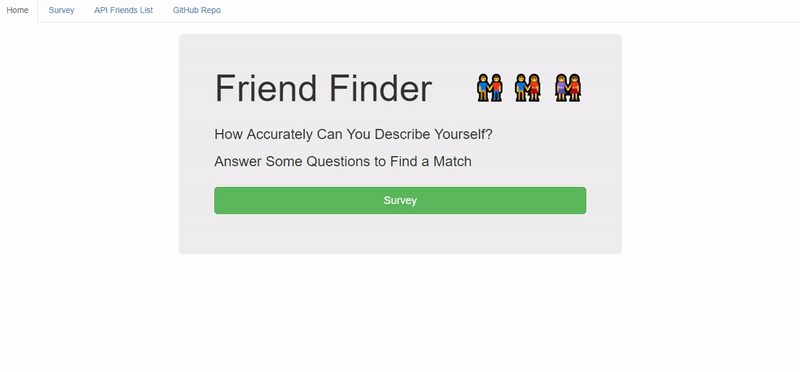
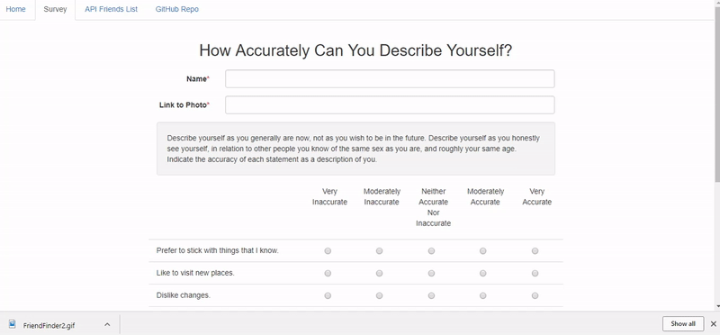

# FriendFinder

[Friend Finder](https://frozen-harbor-45251.herokuapp.com/home) is a compatibility-based application that takes in results from a user's survey, compares his or her answers with those from other users. The app then displays the name and picture of the user with the best overall match.

**FriendFinder** uses the following packages:
* **[express](https://expressjs.com/)**: minimal and flexible Node.js web application framework
* **[body-parser](https://www.npmjs.com/package/body-parser)**: intercepts requests with the X-JSON-Body: field header and replaces req.body with the parsed contents of req.body.field
* **[path](https://www.npmjs.com/package/path)**: provides utilities for working with file and directory paths

## Functionality

Upon initial load, the existing data in the Friends API is accessible through the navbar. Note there are three default users listed, and each object contains a user's name, photo link, and scores for 10 questions.

The survey consists of:
* two required text fields for the user's name and a link to a photo
* ten 5-level Likert items to assess how accurately each statement reflects the user's ["adventurousness"](https://ipip.ori.org/newNEOKey.htm#Adventurousness)

International Personality Item Pool: A Scientific Collaboratory for the Development of Advanced Measures of Personality Traits and Other Individual Differences (http://ipip.ori.org/). Internet Web Site. 

When the user clicks the submit button, his or her responses are added to the Friends API. The user's "adventurousness" score is compared to all of the existing users in the Friends API. The user with the closest match is returned in a modal pop-up displaying the matching user's name and photo.

Because this application is deployed to Heroku, the newly submitted survey reponse is now added to the Friends API (which resets once per day). 

